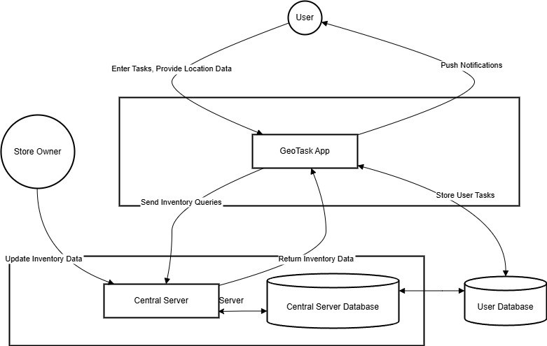

# GeoTask: Smart Geo-Fencing To-Do List App

GeoTask is an Android-based smart to-do list application that combines **AI-driven task categorization**, **geo-fencing**, and **real-time inventory integration** to help users complete daily tasks more efficiently. Instead of manually assigning location-based reminders, users simply enter tasks in natural language — the app automatically categorizes them, links them to relevant nearby locations, and sends push notifications when the user is in the vicinity.

A standout feature is real-time integration with local businesses: store owners can update their inventory dynamically, so users always know whether a product is available before making a trip.

---

## Problem Statement

Existing task management apps (Google Keep, Todoist, Apple Reminders) require manual input for both task categorization and location assignment. They do not:
- Automatically categorize tasks or suggest relevant locations using AI
- Notify users proactively based on real-time proximity
- Integrate with local store inventory for up-to-date product availability

This leads to missed tasks, redundant trips, and overall inefficiency for on-the-go users.

---

## Proposed System

GeoTask addresses these gaps through four core modules:

### 1. AI-Powered Task Sorting
Uses NLP (Natural Language Processing) to automatically classify user-entered tasks and map them to relevant location types (e.g., "paracetamol" → pharmacy, "milk" → grocery store).

### 2. Geo-Fencing & Notifications
Leverages **Google's GeoFence API** to create virtual boundaries around task-relevant locations. Push notifications are triggered automatically when the user enters a geo-fenced area.

### 3. Real-Time Database Integration
A centralized database (Firebase/MySQL) allows store owners to update stock and service availability in real time, giving users accurate on-demand information about nearby resources.

### 4. Energy-Efficient Location Tracking
Uses the **Fused Location Provider API** (combining GPS, Wi-Fi, and mobile networks) to balance location accuracy with battery efficiency — reducing update frequency when the user is stationary.

---

## System Architecture

### Data Flow Diagram

The DFD shows interactions between four key entities:
- **User** — inputs tasks and location data; receives push notifications
- **Store Owner** — sends inventory updates via the GeoTask App to the Central Server
- **GeoTask App** — processes tasks, manages geo-fences, stores user data in User Database
- **Central Server + Database** — handles all inventory queries and data synchronization

---

## Features

| Feature | Description |
|---|---|
| NLP Task Categorization | Automatically classifies tasks by type and suggests matching location categories |
| Location-Based Reminders | Push notifications triggered on geo-fence entry/exit |
| Real-Time Store Inventory | Store owners update stock dynamically; users see current availability |
| Energy-Efficient Tracking | Adaptive location polling via Fused Location Provider API |
| User & Store Owner Roles | Separate dashboards and permission sets for each role type |
| Analytics Module | Task completion history, geofence interaction stats, store engagement reports |

---

## Tech Stack

| Layer | Technology |
|---|---|
| Language | Kotlin |
| IDE | Android Studio |
| UI Framework | Android Jetpack (LiveData, ViewModel, Navigation) |
| Geo-Fencing | Google GeoFence API |
| Location | Fused Location Provider API |
| AI / NLP | Firebase ML Kit / TensorFlow |
| Database | Firebase Realtime Database / MySQL |
| Backend | Node.js / Firebase Cloud Functions |
| Frontend (Web Portal) | HTML, CSS, Bootstrap, JavaScript |

---

## Functional Requirements

- **Task Sorting** — NLP-based automatic task classification and location matching
- **Geo-Fencing** — Virtual boundary setup and proximity-based push notifications
- **Real-Time Store Updates** — Centralized database with live stock management
- **User Interface** — Map view, task list, notification preferences
- **Database Management** — Secure storage for user tasks, store details, and location data

## Non-Functional Requirements

- Load time < 2 seconds for tasks and location data
- Energy-efficient continuous tracking
- Secure encrypted data transfers with user consent for location access
- Scalable to support growing user base and store inventory volume

---

## System Requirements

**Mobile Device:**
- Android 7.0 (Nougat) or above
- GPS, Wi-Fi, and cellular connectivity
- Minimum 2 GB RAM, 100 MB storage
- Battery ≥ 3000 mAh

**Server:**
- Cloud-based (Firebase / AWS) with real-time database support
- Sufficient bandwidth for high-traffic data requests

---

## Modules

1. **User Authentication** — Registration, login, role assignment (User / Store Owner / Admin), password reset
2. **Geo-Fencing** — Create, modify, delete personal or store-level geofences
3. **Task Management** — Create tasks linked to geofences, mark complete, view history
4. **Notifications & Alerts** — Location-triggered push alerts, configurable preferences
5. **Location Services** — GPS tracking, permission management, proximity monitoring
6. **Data Storage & Management** — Encrypted task/user data, geofence history, store analytics
7. **User Interface** — Map visualization, task dashboard, store owner portal
8. **Analytics & Reporting** — Task completion stats, customer engagement reports

---

## Literature Survey

| Ref | Paper | Key Contribution |
|---|---|---|
| [1] | Context-Aware Mobile Application (CAMA) | Geofencing for per-app authentication on Android |
| [2] | Smart Geo-Fencing with LSPA | Automated affinity-based geofence design from usage history |
| [3] | C-MOSDEN | Energy-efficient context-aware mobile sensing for IoT |
| [4] | Automatic Sentiment Analysis | NLP methodology for subjective and objective data |
| [5] | Infrastructure-Assisted Geofencing | Offloading location monitoring to cloud for battery savings |

---

## Conclusion

GeoTask redefines task management by replacing manual reminder setup with intelligent, context-aware automation. By combining NLP-based task sorting, geo-fencing, energy-efficient location tracking, and real-time business inventory integration, the app delivers reminders at precisely the right time and place. Its modular architecture ensures scalability, while the analytics layer provides actionable insights for both users and local businesses.

---
